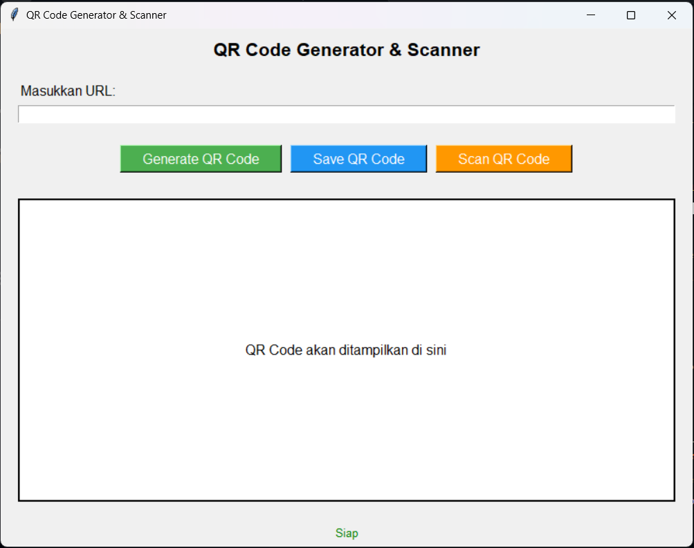

# QR Code Generator & Scanner

Pernah gak sih kalian butuh bikin QR Code buat share link tapi ribet? Atau mau scan QR Code tapi males install app yang aneh-aneh? Nah, ini dia solusinya! Aplikasi desktop simpel yang bisa bikin dan scan QR Code langsung dari komputer.

## Apa aja yang bisa dilakukan?

- 🔥 **Bikin QR Code**: Tinggal masukin URL, langsung jadi QR Code keren
- 💾 **Simpan QR Code**: Download sebagai PNG, siap dipake dimana aja
- 📷 **Scan QR Code**: Pake webcam buat scan QR Code, gampang banget
- 🌐 **Buka Link Otomatis**: Ketemu QR Code? Langsung tanya mau buka linknya gak
- 😎 **Interface Gampang**: Desain simpel, siapa aja bisa pake

## Screenshot



## Butuh apa aja sih?

- Python 3.7 ke atas (yang lama juga harusnya work sih)
- Webcam/kamera laptop (buat scan QR Code)
- Windows, macOS, atau Linux (terserah pake yang mana)

## Cara install

Gampang kok, ikutin aja step by step:

1. Download atau clone dulu:

```bash
git clone https://github.com/Skynixxx/generate-qr-from-link.git
cd qr-code-generator
```

2. Install library yang dibutuhin:

```bash
pip install qrcode[pil] opencv-python pyzbar pillow
```

### Library yang kepake

- `qrcode[pil]`: Buat bikin QR Code nya
- `opencv-python`: Buat akses kamera dan computer vision
- `pyzbar`: Buat baca QR Code dan barcode
- `pillow`: Buat editing gambar
- `tkinter`: Buat interface nya (biasanya udah ada di Python)

## Gimana cara makenya?

### Jalanin aplikasinya

```bash
python qr.py
```

### Bikin QR Code

1. Ketik URL yang mau dijadiin QR Code
2. Klik **"Generate QR Code"**
3. Taraaa! QR Code langsung muncul
4. Kalo mau disimpan, klik **"Save QR Code"**

### Scan QR Code

1. Klik **"Scan QR Code"**
2. Kamera bakal terbuka otomatis
3. Arahin kamera ke QR Code yang mau di-scan
4. Kalo udah selesai, tekan **ESC**
5. Kalo ketemu QR Code, bakal ditanya mau buka linknya gak

## Struktur File

```
qr-code-generator/
├── qr.py              # File utama aplikasi
├── README.md          # Dokumentasi
├── __pycache__/       # Cache Python
│   └── qr.cpython-312.pyc
└── generated-files/   # QR Code yang dihasilkan
    ├── qr_2.png
    └── image 3.png
```

## Fitur Detail

### QR Code Generator

- Mendukung berbagai jenis URL
- Otomatis menambahkan protokol `https://` jika tidak ada
- Kustomisasi ukuran dan kualitas QR Code
- Preview real-time

### QR Code Scanner

- Real-time scanning menggunakan webcam
- Deteksi multiple QR Code dalam satu frame
- Visual feedback dengan highlight box
- Konfirmasi sebelum membuka URL

### User Interface

- Design yang clean dan modern
- Status indicator untuk feedback
- Error handling yang informatif
- Responsive layout

## Ada masalah? Coba ini dulu

### Error: "Gak bisa akses kamera"

- Cek dulu kameranya dipake app lain gak
- Pastiin permission kamera udah diizinin
- Coba restart app atau komputernya

### Error: "ModuleNotFoundError"

- Berarti ada library yang belum ke-install:

```bash
pip install qrcode[pil] opencv-python pyzbar pillow
```

### Error: "Gagal baca QR Code"

- Pastiin QR Code keliatan jelas di kamera
- Coba di tempat yang lebih terang
- Jangan QR Code yang udah rusak atau blur

## Pengembangan

### Menjalankan dalam Mode Development

```bash
python qr.py
```

### Menambah Fitur Baru

Aplikasi ini menggunakan arsitektur class-based yang mudah dikembangkan:

- `QRCodeGenerator`: Class utama yang mengelola UI dan logic
- `setup_ui()`: Method untuk setup interface
- `generate_qr()`: Method untuk generate QR Code
- `scan_qr_codes()`: Method untuk scanning QR Code

### Customization

Anda dapat mengcustomize:

- Ukuran QR Code
- Error correction level
- Warna QR Code
- UI theme dan layout

## Lisensi

MIT License

Copyright (c) 2025 Muhammad Fikri Haikal

Permission is hereby granted, free of charge, to any person obtaining a copy
of this software and associated documentation files (the "Software"), to deal
in the Software without restriction, including without limitation the rights
to use, copy, modify, merge, publish, distribute, sublicense, and/or sell
copies of the Software, and to permit persons to whom the Software is
furnished to do so, subject to the following conditions:

The above copyright notice and this permission notice shall be included in all
copies or substantial portions of the Software.

THE SOFTWARE IS PROVIDED "AS IS", WITHOUT WARRANTY OF ANY KIND, EXPRESS OR
IMPLIED, INCLUDING BUT NOT LIMITED TO THE WARRANTIES OF MERCHANTABILITY,
FITNESS FOR A PARTICULAR PURPOSE AND NONINFRINGEMENT. IN NO EVENT SHALL THE
AUTHORS OR COPYRIGHT HOLDERS BE LIABLE FOR ANY CLAIM, DAMAGES OR OTHER
LIABILITY, WHETHER IN AN ACTION OF CONTRACT, TORT OR OTHERWISE, ARISING FROM,
OUT OF OR IN CONNECTION WITH THE SOFTWARE OR THE USE OR OTHER DEALINGS IN THE
SOFTWARE.

## Author

**Muhammad Fikri Haikal**

Dibuat dengan menggunakan Python

- 📧 Email: [fikrihaikal170308@gmail.com](fikrihaikal170308@gmail.com)
- 💼 GitHub: [@Skynixxx](https://github.com/Skynixxx)

## Update History

### v1.0.0 (Versi pertama!)

- Fitur bikin QR Code ✅
- Fitur scan QR Code pake kamera ✅
- Bisa save QR Code ke file ✅
- Auto buka URL yang ke-scan ✅

---

**Tips**: Jangan lupa kasih permission kamera pas pertama kali buka aplikasi ya!
